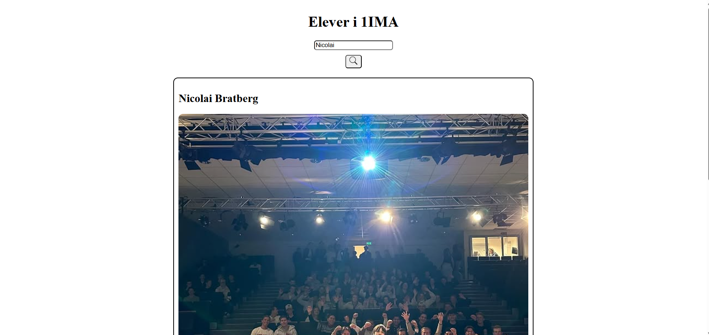

<h1 align="center">JavaScript if/else setninger</h1> 
<div align="center"> 
    <h3> 
        <a href="rettlaks.github.io/Personer/"> Lenken til prosjektet 
        </a> 
    </h3> 
</div> 
<!-- TABLE OF CONTENTS -->

## Table of Contents

- [Oversikt](#oversikt)
- [Bygget med](#bygget-med)
- [Features](#features)
- [Hvordan bruke](#hvordan-bruke)
- [Kontakt](#Kontakt)

<!-- OVERVIEW -->
## Oversikt
Se nederst

### Bygget med
- [HTML](https://www.w3schools.com/html/)
- [CSS](https://www.w3schools.com/css/default.asp)
- [JavaScript](https://www.w3schools.com/js/default.asp)

## Features
- JavaScript objects
- Søkefelt
- Database med personer


## Hvordan bruke
Hvilke koder har du brukt? Skrive her:

```
HTML 
- https://www.w3schools.com/html/

CSS 
- https://css-tricks.com/snippets/css/a-guide-to-flexbox/

JavaScript
- https://www.w3schools.com/js/js_events.asp
- https://www.w3schools.com/js/js_functions.asp
- https://www.w3schools.com/js/js_output.asp
- https://www.w3schools.com/jsref/jsref_obj_object.asp

```

## Kontakt
- GitHub [Meg](https://github.com/Sjalabaisen)
- Epost [Meg](mailto:simenhei@afk.no)


## Happy coding!

## Forventet resultat

